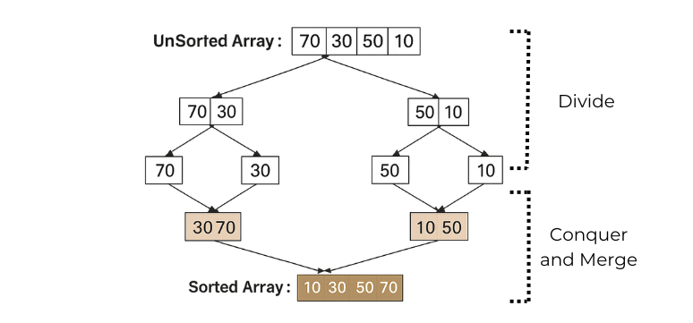
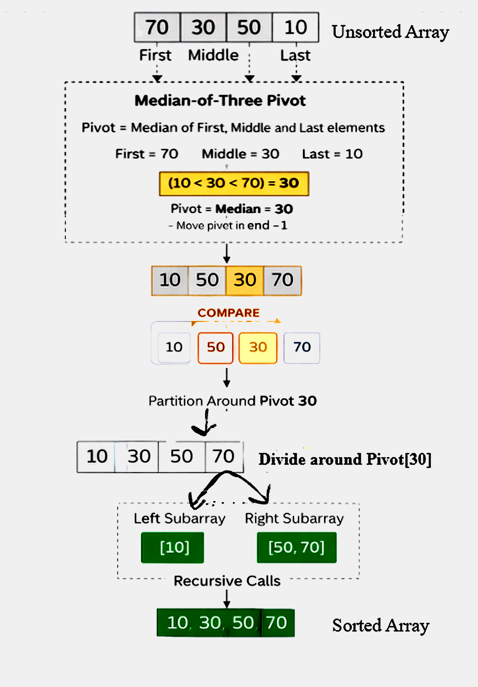

### Introduction

Sorting is a fundamental operation in computer science that involves arranging elements of a dataset in a specified order, typically in ascending or descending order. Efficient sorting is essential because many operations such as searching, indexing, data analysis, and optimization perform significantly faster on sorted data.

Among various sorting techniques, Divide and Conquer–based algorithms are widely used due to their efficiency and structured approach. These algorithms decompose a large problem into smaller subproblems, solve them independently, and then combine their results to obtain the final solution. In this experiment, two important Divide and Conquer sorting algorithms—Merge Sort and Quick Sort—are studied and visualized.

### Divide and Conquer Paradigm

The Divide and Conquer strategy consists of three fundamental steps:

1. **Divide**
   The given problem is divided into smaller subproblems of the same type.

2. **Conquer**
   Each subproblem is solved recursively until it becomes simple enough to solve directly.

3. **Combine**
   The solutions of the subproblems are combined to produce the final solution.

This paradigm significantly reduces computational complexity for large input sizes and forms the theoretical foundation of efficient sorting algorithms.

### Merge Sort

Merge Sort is a stable, comparison-based sorting algorithm that strictly follows the Divide and Conquer approach. Its performance is predictable and independent of the initial arrangement of elements.

#### Working Principle

1. The input array is recursively divided into two halves.
2. The division continues until each subarray contains only one element.
3. Since a single element is inherently sorted, adjacent subarrays are merged in sorted order.
4. The merging process continues until the entire array is merged into one sorted array.

The divide and merge process is clearly illustrated in the visualization, showing how the array is broken down and then reconstructed in sorted order.

#### Example of Merge Sort
Consider the array: **[70, 30, 50, 10]**

**Step 1: Divide**
Split the array into two halves: `[70, 30]` and `[50, 10]`

**Step 2: Recursive Division**
Further split down to individual elements: `[70], [30]` and `[50], [10]`

**Step 3: Merge**
Compare and merge elements into sorted subarrays: `[30, 70]` and `[10, 50]`

**Step 4: Final Merge**
Combine the sorted halves into the final sorted array: `[10, 30, 50, 70]`

  

#### Characteristics of Merge Sort

- **Time Complexity**
  - Best Case: O(n log n)
  - Average Case: O(n log n)
  - Worst Case: O(n log n)

- **Stability**
  - Preserves the relative order of equal elements.

- **Space Complexity**
  - Requires additional auxiliary memory for merging.

- **Performance**
  - Independent of input order and highly predictable.

Merge Sort is well-suited for large datasets, linked lists, and applications where stability is required.

---

### Quick Sort

Quick Sort is a highly efficient, in-place, comparison-based sorting algorithm that also follows the Divide and Conquer paradigm. Unlike Merge Sort, Quick Sort does not use extra memory for merging; instead, it relies on an effective partitioning mechanism.

In this experiment, Median-of-Three pivot selection is used to improve performance and reduce the likelihood of worst-case behavior.

#### Working of Quick Sort (Median-of-Three Pivot Selection)

**1. Pivot Selection**
Three elements are selected from the array:
- The first element
- The middle element
- The last element

These three values are compared, and the median value (neither the smallest nor the largest) is chosen as the pivot. For example, if the values are a, b, and c:
- If a > b > c or c > b > a, then b is selected as the pivot.

To simplify partitioning, the selected pivot is temporarily placed at the `end - 1` index of the array. This strategy avoids poor pivot choices and improves overall performance.

**2. Partitioning Process**
Two pointers are used:
- Pointer **i** moves from left to right.
- Pointer **j** moves from right to left.

Pointer **i** advances while elements are smaller than the pivot. Pointer **j** moves backward while elements are greater than the pivot. When both pointers stop and `i < j`, the elements at these positions are swapped. This process continues until the pointers cross. Finally, the pivot is placed in its correct sorted position.

After partitioning:
- All elements smaller than the pivot are positioned on the left.
- All elements greater than the pivot are positioned on the right.

The same steps are recursively applied to the left and right subarrays.

#### Example of Quick Sort
Consider the array: **[70, 30, 50, 10]**

**Step 1: Pivot Selection**
- First = 70, Middle = 30, Last = 10
- Median-of-Three pivot = **30** (since 10 < 30 < 70)

**Step 2: Partitioning**
- Elements less than 30 → `[10]`
- Pivot → `[30]`
- Elements greater than 30 → `[70, 50]`

**Step 3: Recursive Sorting**
- Sort `[10]` → already sorted
- Sort `[70, 50]`:
  - Pivot = 50 (based on sub-range selection)
  - Partition → `[50, 70]`

**Final Sorted Array: [10, 30, 50, 70]**

  

#### Characteristics of Quick Sort

- **Time Complexity**
  - Best Case: O(n log n)
  - Average Case: O(n log n)
  - Worst Case: O(n²) (rare with Median-of-Three selection)

- **Space Complexity**
  - In-place; requires only recursive stack space.

- **Stability**
  - Not stable; the relative order of equal elements may change.

- **Performance Dependency**
  - Strongly dependent on pivot selection and input distribution.

Median-of-Three pivot selection significantly reduces the probability of worst-case behavior, making Quick Sort highly efficient in practice.

---

### Comparison of Merge Sort and Quick Sort

| Feature | Merge Sort | Quick Sort |
| :--- | :--- | :--- |
| **Strategy** | Divide and merge | Divide via partitioning |
| **Time Complexity** | O(n log n) (all cases) | O(n log n) average |
| **Space Usage** | Extra memory required | In-place |
| **Stability** | Stable | Not stable |
| **Input Sensitivity** | Independent of input order | Depends on pivot selection |
| **Practical Speed** | Moderate | Usually faster |

---

### Conclusion

This experiment demonstrates the application of the Divide and Conquer paradigm to sorting through Merge Sort and Quick Sort. Merge Sort provides stable and consistent performance, while Quick Sort achieves superior practical speed through efficient partitioning and optimized pivot selection. The visualization effectively illustrates recursive division, pivot selection, pointer scanning, comparison behavior, and final array construction, leading to a clear understanding of both algorithms and their operational differences.
